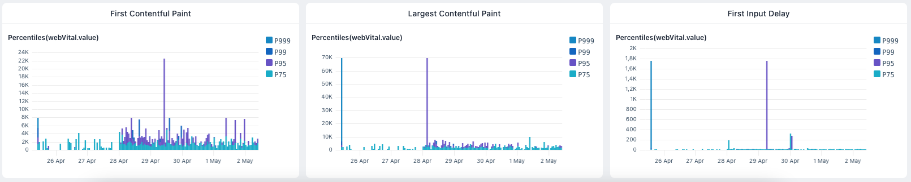

# next-axiom [](https://github.com/axiomhq/next-axiom/actions/workflows/ci.yml)



Send Web-Vitals and logs from Next.js to [Axiom](https://axiom.co).

## Get started

1. Make sure you have the [Axiom Vercel integration](https://www.axiom.co/vercel) installed or export `NEXT_PUBLIC_AXIOM_INGEST_ENDPOINT`
2. In your Next.js project, run `npm install --save next-axiom`
3. Wrap your Next.js config in `withAxiom` like this in `next.config.js`:

```js
const { withAxiom } = require('next-axiom')

module.exports = withAxiom({
  // ... your existing config
})
```

This will proxy the Axiom ingest call from the frontend to improve deliverability.

## Reporting WebVitals

Go to `pages/_app.js` or `pages/_app.ts` and add the following line:
```js
export { reportWebVitals } from 'next-axiom'
```

> **Note**: WebVitals are only sent from production deployments.

## Sending Logs

1. Import Axiom's logger
```js
import { log } from 'next-axiom';
```
2. If you want to log from a function, wrap it using `withAxiom` like this:
```js
// serverless function
async function handler(req, res) {
  log.info("hello from function")
  res.status(200).text('hi')
}

export default withAxiom(handler)
```
```js
// middleware function
import { NextResponse } from 'next/server'

async function handler(req, ev) {
  log.info("hello from middleware")
  return NextResponse.next()
}

export default withAxiom(handler)
```

This will log exceptions as well as making sure logs are flushed.

3. Use the logger to send logs to Axiom, you can attach other metadata to your 
logs by passing them as parameters:

```js
log.info('hello, world!')
log.debug('debugging information', { foo: 'bar', x: 'y' })
log.warn('be careful!')
log.error('oops!')
```

4. Deploy your site and watch data coming into your Axiom dataset.

### Configuration

When env vars are not detected, Pretty printing to console is enabled by 
default, to disable it set the environment variable:
```
AXIOM_PRETTY_PRINT_ENABLED=false
```
